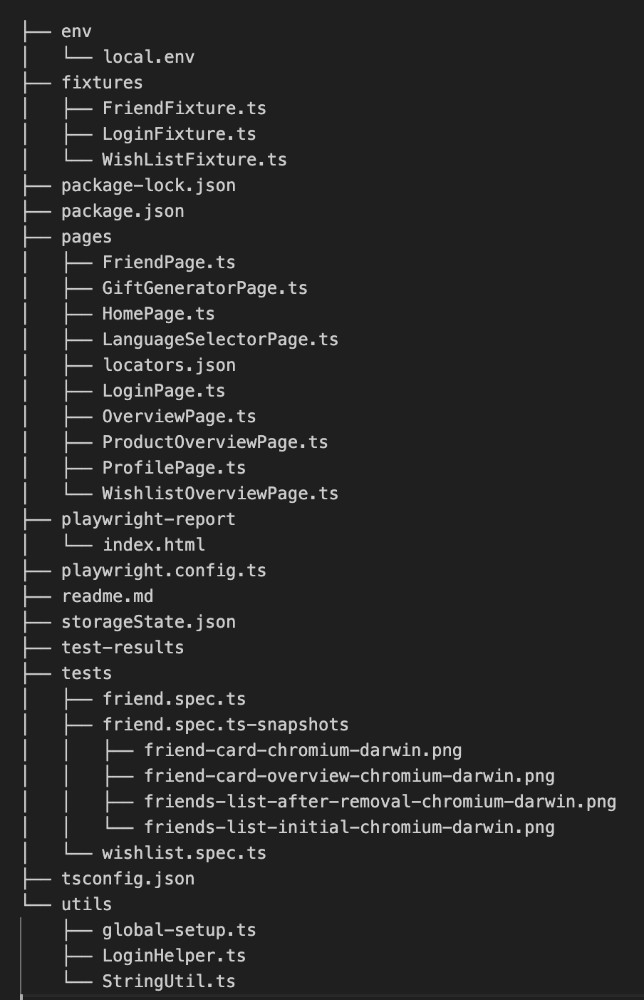

## To install Playwright, you can follow these steps:

1. Install Node.js if you haven't already.
2. Create a directory of your choice e.g. onskeyskyen-tests and then move to that directory
3. Run the following command
   ``` npm init playwright@latest ```
4. Choose the scripting language i.e. javascript or typescript
5. Choose if you want to have a github actions workflow created 
6. Choose the folder to add your tests
7. Also, install dotenv using the command
   ``` npm install dotenv ```
 

For more detailed instructions, you can refer to the Playwright documentation.

## The automation task includes 2 spec files covering E2E scenarios for the following tests

1. Add a friend, confirm a friend from pending request and then remove the friend from the list
2. Create a Wishlist, add a wish in that wishlist, delete Wish and archive the Wishlist
3. Add wish from gift generator product list

## Project structure includes following 



## Implementation includes :

1. Parallel execution enabled in playwright config file (playwright.config.ts)
2. Authentication handled using global-setup.ts and stored in storageState.json
3. Playwright fixtures FriendFixture.ts and WishListFixture.ts for both the specs
4. Github action workflow created using playwright.yml file
5. Screenshot assertion added as a trial for element level snapshots
## Execution 
Execute the spec files by running the following commands (2nd one if you need to update screenshots)
    ``` npx playwright test ```  or  ``` npx playwright test --update-snapshots``` 


